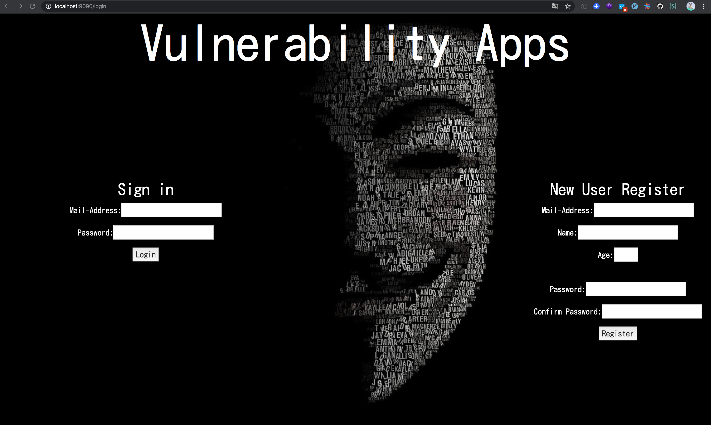

# Vulnerability-goapp
Vulnerable golang Web application for education

## Note
This application has some vulnerabilities
So, Use for educational or research purposes only 

## Run-Environmant

- docker-compose
  - golang
    - Vulnerability Application
    - CSRF-Trap Application
  - MySQL

## Image



## How to Run

#### docker-compose
1. cd Vulnerability-goapp
2. docker-compose up

#### Web Application
1. Access 'http://localhost:9090/login' on browser ( Google Chrome recommended )


#### CSRF-TRAP-Application
1. Access 'http://localhost:3030/scrftrap' on browser ( Google Chrome recommended )

*Note: If you run this app on SaaS (like EC2), CSRF-TRAP-Application view pages(HTML) need to change redirect form destination suit for running-environmant*

[./Trap](https://github.com/Hardw01f/Vulnerability-goapp/tree/docs/ModifyReadme/Trap)

*Note. CSRF will be expressed when you access this page, so please be careful when access this page*

### First Users

```
MailAddress: RX-78-2@EFSF.com
Password : Amuro,Ikima-su!
```

```
MailAddress: MS-06-S@Zeon.com
Password : AkaiSuisei
```

### Admin Pages

1. login some user and go top page
2. go 'http://localhost:9090/adminlogin'

```
AdminMailAddress: admin@admin.com
Password : Qwerty1234
``` 

### The Payloads

[Payloads](https://github.com/Hardw01f/Vulnerability-goapp/blob/docs/ModifyReadme/Payloads.md)
